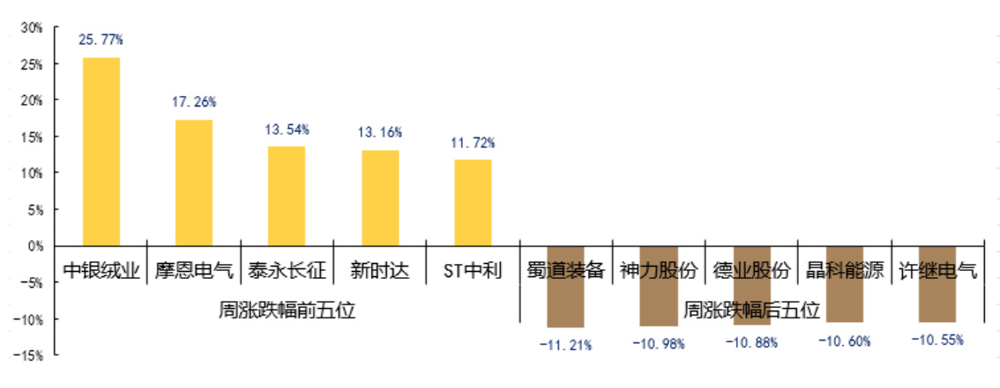

上周电力设备新能源板块涨幅前五分别为中银绒业（ $25.77\%.1$ ）、摩恩电气（ $\langle17.26\%\rangle$ ）、泰永长征（ $13.54\%.$ ）、新时达（ $13.16\%)$ ）、ST 中利（ $11.72\%.$ ）。跌幅前五名分别为蜀道装备 $(\cdot11.21\%)$ ）、神力股份（ $({\cdot}10.98\%)$ ）、德业股份（ $({\it\Delta}\cdot10.88\%)$ ）、晶科能源（ $\langle.10.60\%.$ ）、许继电气（ $\langle.10.55\%\rangle$ ）。  

<td><table  border="1"><thead><tr><td><b>板块名称</b></td><td><b>代码</b></td><td><b>当日收盘价</b></td><td><b>周基准日收盘价</b></td><td><b>一周涨跌幅</b></td><td><b>月基准日收盘价</b></td><td><b>一月涨跌幅</b></td><td><b>市盈率</b></td><td><b>市净率</b></td></tr></thead><tbody><tr><td>上证综指</td><td>000001.SH</td><td>3,131.95</td><td>3,189.25</td><td>-1.80%</td><td>3,167.75</td><td>-1.13%</td><td>12.79</td><td>1.32</td></tr><tr><td>深证综指</td><td>399001.SZ</td><td>10,458.51</td><td>10,808.87</td><td>-3.24%</td><td>10,810.18</td><td>-3.25%</td><td>22.33</td><td>2.40</td></tr><tr><td>沪深300</td><td>000300.SH</td><td>3,784.00</td><td>3,884.25</td><td>-2.58%</td><td>3,821.91</td><td>-0.99%</td><td>11.49</td><td>1.34</td></tr><tr><td>CS电力设备</td><td>CI005011.WI</td><td>9,383.60</td><td>9,726.87</td><td>-3.53%</td><td>9,699.37</td><td>-3.26%</td><td>21.93</td><td>2.96</td></tr><tr><td>输变电设备</td><td>CI005472</td><td>1,668.13</td><td>1,738.64</td><td>-4.06%</td><td>1,783.31</td><td>-6.46%</td><td>19.86</td><td>2.33</td></tr><tr><td>配电设备</td><td>CI005473</td><td>1,416.28</td><td>1,441.05</td><td>-1.72%</td><td>1,484.66</td><td>-4.61%</td><td>25.12</td><td>2.06</td></tr><tr><td>光伏</td><td>CI005286</td><td>11,981.96</td><td>12,688.68</td><td>-5.57%</td><td>12,752.63</td><td>-6.04%</td><td>13.23</td><td>3.09</td></tr><tr><td>风电</td><td>CI005284</td><td>3,106.18</td><td>3,213.73</td><td>-3.35%</td><td>3,261.85</td><td>-4.77%</td><td>29.01</td><td>1.80</td></tr><tr><td>核电</td><td>CI005476</td><td>1,505.97</td><td>1,497.14</td><td>0.59%</td><td>1,534.28</td><td>-1.85%</td><td>40.51</td><td>1.59</td></tr><tr><td>新能源汽车</td><td>884076.WI</td><td>3,138.89</td><td>3,258.98</td><td>-3.68%</td><td>3,248.75</td><td>-3.38%</td><td>21.85</td><td>2.88 </td></tr></tbody></table></td>

资料来源：WIND，德邦研究所  

  
图21 电力设备及新能源A 股个股一周涨跌幅前5 位及后5 位  

# 5. 风险提示  

原材料价格波动风险、疫情影响超预期风险、行业竞争加剧风险  